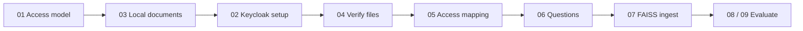

# Permission-Aware RAG

This repository contains the official implementation for the paper:  
**Permission-Aware RAG: Identity and Access Management (IAM)-Based Access Filtering in Multi-Resource Environments**  

---

## Architecture

This local setup performs retrieval from a centralized FAISS vector store and delegates
**real-time access control to Keycloak Authorization Services**. Documents are stored on
disk under `artifacts/resources/KEYCLOAK/` — no GCP or AWS is required.

RBAC is enforced via Keycloak client roles mapped to document collections; ABAC attribute
matches are encoded as additional role grants at provisioning time.

---

## Key Features

- **Fine-Grained Access Control**: Enforces document-level permissions for RAG pipelines.
- **Keycloak IAM**: Real-time permission checks via Keycloak Authorization Services.
- **Local-first**: Documents stay on disk; only Keycloak (Docker) is needed for IAM.
- **RBAC + ABAC**: Collections with roles and attribute-based grants.

---


## Repository Structure

- `/scripts`: End-to-end Python scripts for running the pipeline, from data preparation to evaluation.  
- `/src`: Core modules of the framework, including the `PermissionRetriever`, `CredentialManager`, and `VectorStore`.  
- `/artifacts`: Stores input data, credentials, FAISS index, and evaluation results.  

---

## Dataset

This project uses the **HotpotQA** dataset for multi-hop question answering experiments.  
Specifically, we rely on the *distractor* split (`hotpot_dev_distractor_v1.json`) for evaluation.  

### Download

The original S3 bucket is no longer available. Download the distractor dev set from Hugging Face:

**Linux / macOS:**
```bash
curl -L -o artifacts/hotpot_dev_distractor_v1.json \
  https://huggingface.co/datasets/namlh2004/hotpotqa/resolve/main/hotpot_dev_distractor_v1.json
```

**Windows (PowerShell):**
```powershell
Invoke-WebRequest `
  -Uri "https://huggingface.co/datasets/namlh2004/hotpotqa/resolve/main/hotpot_dev_distractor_v1.json" `
  -OutFile "artifacts/hotpot_dev_distractor_v1.json"
```

The dataset file should be placed in the `artifacts/` directory (~61 MB).

## Setup & Installation

### 1. Prerequisites

- Python 3.10+ and [uv](https://docs.astral.sh/uv/)
- [Docker](https://www.docker.com/) (for local Keycloak IAM)
- OpenAI API key (for evaluation scripts 08–09)

This fork runs **locally with Keycloak only** — no GCP or AWS account is required. Documents stay on disk under `artifacts/resources/`; permission checks go through Keycloak Authorization Services.

Legacy scripts for GCP/AWS (`02_gcp_aws_resource_creator.py`, `04_upload_resources.py`) remain in `/scripts` for the original paper setup but are not used in the local workflow below.

### 2. Clone Repository

```bash
git clone https://github.com/your-username/permission-aware-rag.git
cd permission-aware-rag
```

### 3. Set Up Python Environment

```bash
uv sync
```

### 4. Start Keycloak

```bash
docker compose up -d
```

Keycloak admin console: http://localhost:8081 (login: `admin` / `admin`).

> If port 8080 is already in use on your machine, this compose file maps host **8081** → container 8080.

### 5. Configure Environment Variables

Copy the example and edit as needed:

```bash
cp .env.example .env
```

```env
# LLM provider: openai | openrouter | gemini
LLM_PROVIDER="openrouter"

# OpenAI (when LLM_PROVIDER=openai)
OPENAI_API_KEY="sk-..."
OPENAI_MODEL="gpt-4o-mini"

# OpenRouter (when LLM_PROVIDER=openrouter)
OPENROUTER_API_KEY="sk-or-..."
OPENROUTER_MODEL="openai/gpt-4o-mini"

# Gemini (when LLM_PROVIDER=gemini)
GOOGLE_API_KEY="..."   # or GEMINI_API_KEY
GEMINI_MODEL="gemini-3.6-flash"

KEYCLOAK_URL="http://localhost:8081"
KEYCLOAK_ADMIN="admin"
KEYCLOAK_ADMIN_PASSWORD="admin"
KEYCLOAK_REALM="permission-aware-rag"
KEYCLOAK_CLIENT_ID="permission-aware-rag-client"
KEYCLOAK_USER_PASSWORD="password"
```

Switch models with `LLM_PROVIDER`. Defaults: OpenAI `gpt-4o-mini`, OpenRouter `openai/gpt-4o-mini`, Gemini `gemini-3.6-flash`.
---

## Running the Pipeline

Run scripts **in order**. Set `PYTHONPATH` first:

```bash
# Linux / macOS
export PYTHONPATH=$(pwd)

# Windows (PowerShell)
$env:PYTHONPATH = (Get-Location).Path
```

```bash
uv run python scripts/01_generate_access_model.py
uv run python scripts/03_prepare_documents.py
uv run python scripts/02_keycloak_resource_creator.py
uv run python scripts/04_verify_local_resources.py
uv run python scripts/05_generate_user_accessible_file_list.py
uv run python scripts/06_generate_question_list.py
uv run python scripts/07_run_ingestion_manager.py
uv run python scripts/08_run_quantitative_evaluation.py
uv run python scripts/09_run_latency_evaluation.py
```

**Note:** Script 02 runs **after** 03 because it registers each document as a Keycloak authorization resource using `file_to_storage_info.json`. Registering all ~13,800 documents can take a long time; for a quicker trial set `KEYCLOAK_RESOURCE_LIMIT=500` in `.env`.

### Script Descriptions

| Script | Purpose |
|--------|---------|
| **01_generate_access_model.py** | Defines Keycloak collections, RBAC roles, ABAC attributes, and users |
| **03_prepare_documents.py** | Builds local document files under `artifacts/resources/KEYCLOAK/` |
| **02_keycloak_resource_creator.py** | Creates Keycloak realm, client, users, resources, and policies |
| **04_verify_local_resources.py** | Verifies local files exist (no cloud upload) |
| **05_generate_user_accessible_file_list.py** | Ground-truth user → document access mapping |
| **06_generate_question_list.py** | Extracts evaluation questions from HotpotQA |
| **07_run_ingestion_manager.py** | Embeds documents and builds the FAISS index |
| **08_run_quantitative_evaluation.py** | Quantitative EM/F1 evaluation (needs OpenAI) |
| **09_run_latency_evaluation.py** | IAM permission-check latency benchmark |

### Pipeline flow




## License

This project is licensed under the Apache License 2.0.  
See the [LICENSE](./LICENSE) file for details.


## Acknowledgements
This project makes use of the [HotpotQA dataset](https://github.com/hotpotqa/hotpot).  
We thank the authors for providing this resource.
