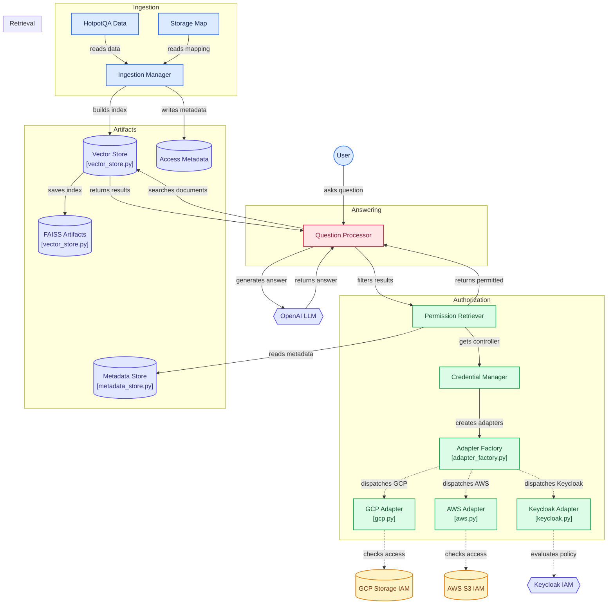

```mermaid
flowchart TD

subgraph group_ingestion["Ingestion"]
  node_hotpot_data["HotpotQA Data"]
  node_storage_map["Storage Map"]
  node_ingestion_manager["Ingestion Manager"]
end

subgraph group_retrieval["Retrieval"]
end

subgraph group_authorization["Authorization"]
  node_permission_retriever["Permission Retriever"]
  node_credential_manager["Credential Manager"]
  node_adapter_factory["Adapter Factory<br/>[adapter_factory.py]"]
  node_gcp_adapter["GCP Adapter<br/>[gcp.py]"]
  node_aws_adapter["AWS Adapter<br/>[aws.py]"]
  node_keycloak_adapter["Keycloak Adapter<br/>[keycloak.py]"]
end

subgraph group_answering["Answering"]
  node_question_processor["Question Processor"]
end

subgraph group_persistence["Artifacts"]
  node_vector_store[("Vector Store<br/>[vector_store.py]")]
  node_metadata_store[("Metadata Store<br/>[metadata_store.py]")]
  node_faiss_artifacts[("FAISS Artifacts<br/>[vector_store.py]")]
  node_access_metadata[("Access Metadata")]
end

node_user(("User"))
node_gcp_storage[("GCP Storage IAM")]
node_aws_storage[("AWS S3 IAM")]
node_keycloak_service{{"Keycloak IAM"}}
node_llm{{"OpenAI LLM"}}

node_hotpot_data -->|"reads data"| node_ingestion_manager
node_storage_map -->|"reads mapping"| node_ingestion_manager
node_ingestion_manager -->|"builds index"| node_vector_store
node_ingestion_manager -->|"writes metadata"| node_access_metadata
node_vector_store -->|"saves index"| node_faiss_artifacts
node_user -->|"asks question"| node_question_processor
node_question_processor -->|"searches documents"| node_vector_store
node_vector_store -->|"returns results"| node_question_processor
node_question_processor -->|"filters results"| node_permission_retriever
node_permission_retriever -->|"reads metadata"| node_metadata_store
node_permission_retriever -->|"gets controller"| node_credential_manager
node_credential_manager -->|"creates adapters"| node_adapter_factory
node_adapter_factory -.->|"dispatches GCP"| node_gcp_adapter
node_adapter_factory -.->|"dispatches AWS"| node_aws_adapter
node_adapter_factory -.->|"dispatches Keycloak"| node_keycloak_adapter
node_gcp_adapter -.->|"checks access"| node_gcp_storage
node_aws_adapter -.->|"checks access"| node_aws_storage
node_keycloak_adapter -.->|"evaluates policy"| node_keycloak_service
node_permission_retriever -->|"returns permitted"| node_question_processor
node_question_processor -->|"generates answer"| node_llm
node_llm -->|"returns answer"| node_question_processor

click node_ingestion_manager "https://github.com/jooyoungjeong/permission-aware-rag/blob/main/src/managers/ingestion_manager.py"
click node_vector_store "https://github.com/jooyoungjeong/permission-aware-rag/blob/main/src/stores/vector_store.py"
click node_metadata_store "https://github.com/jooyoungjeong/permission-aware-rag/blob/main/src/stores/metadata_store.py"
click node_question_processor "https://github.com/jooyoungjeong/permission-aware-rag/blob/main/src/processors/question_processor.py"
click node_permission_retriever "https://github.com/jooyoungjeong/permission-aware-rag/blob/main/src/retrievers/permission_retriever.py"
click node_credential_manager "https://github.com/jooyoungjeong/permission-aware-rag/blob/main/src/managers/credential_manager.py"
click node_adapter_factory "https://github.com/jooyoungjeong/permission-aware-rag/blob/main/src/adapters/iam/adapter_factory.py"
click node_gcp_adapter "https://github.com/jooyoungjeong/permission-aware-rag/blob/main/src/adapters/iam/gcp.py"
click node_aws_adapter "https://github.com/jooyoungjeong/permission-aware-rag/blob/main/src/adapters/iam/aws.py"
click node_keycloak_adapter "https://github.com/jooyoungjeong/permission-aware-rag/blob/main/src/adapters/iam/keycloak.py"
click node_faiss_artifacts "https://github.com/jooyoungjeong/permission-aware-rag/blob/main/src/stores/vector_store.py"
click node_access_metadata "https://github.com/jooyoungjeong/permission-aware-rag/blob/main/src/managers/ingestion_manager.py"

classDef toneNeutral fill:#f8fafc,stroke:#334155,stroke-width:1.5px,color:#0f172a
classDef toneBlue fill:#dbeafe,stroke:#2563eb,stroke-width:1.5px,color:#172554
classDef toneAmber fill:#fef3c7,stroke:#d97706,stroke-width:1.5px,color:#78350f
classDef toneMint fill:#dcfce7,stroke:#16a34a,stroke-width:1.5px,color:#14532d
classDef toneRose fill:#ffe4e6,stroke:#e11d48,stroke-width:1.5px,color:#881337
classDef toneIndigo fill:#e0e7ff,stroke:#4f46e5,stroke-width:1.5px,color:#312e81
classDef toneTeal fill:#ccfbf1,stroke:#0f766e,stroke-width:1.5px,color:#134e4a
class node_hotpot_data,node_storage_map,node_ingestion_manager,node_user toneBlue
class node_permission_retriever,node_credential_manager,node_adapter_factory,node_gcp_adapter,node_aws_adapter,node_keycloak_adapter toneMint
class node_question_processor toneRose
class node_vector_store,node_metadata_store,node_faiss_artifacts,node_access_metadata,node_keycloak_service,node_llm toneIndigo
class node_gcp_storage,node_aws_storage toneAmber
```
